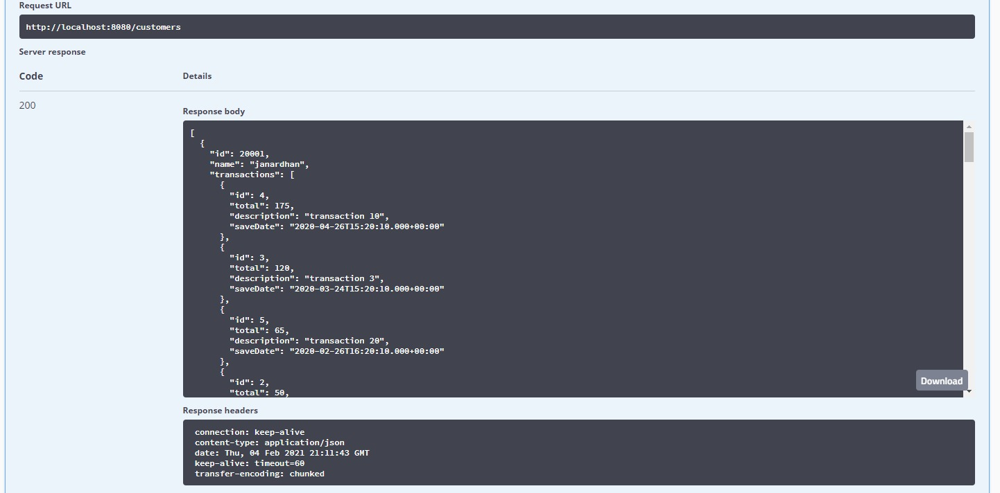
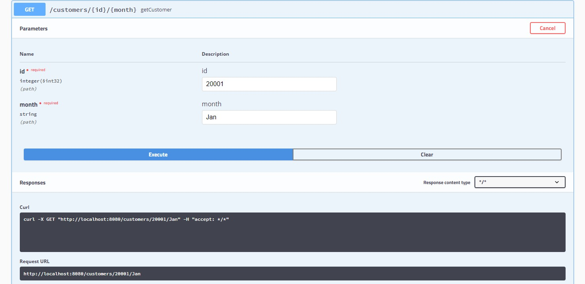
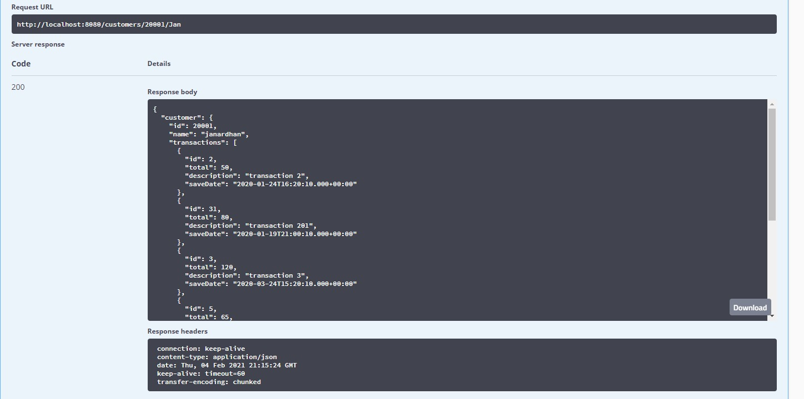
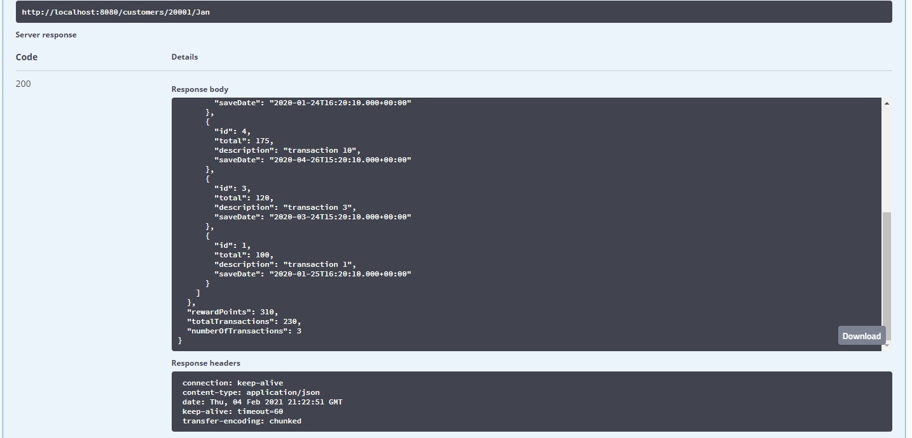

RewardsProgramApplication
The swagger Url to check on the application is http://localhost:8080/swagger-ui.html
-> this has 2 endpoints 
-> /customers end point all the data of all customers
-> /customers/{id}/{month}
-> when entered the Id and month shows the points for that particular month and also total points of the customer.

->The above picture shows the /customers endpoint output.

